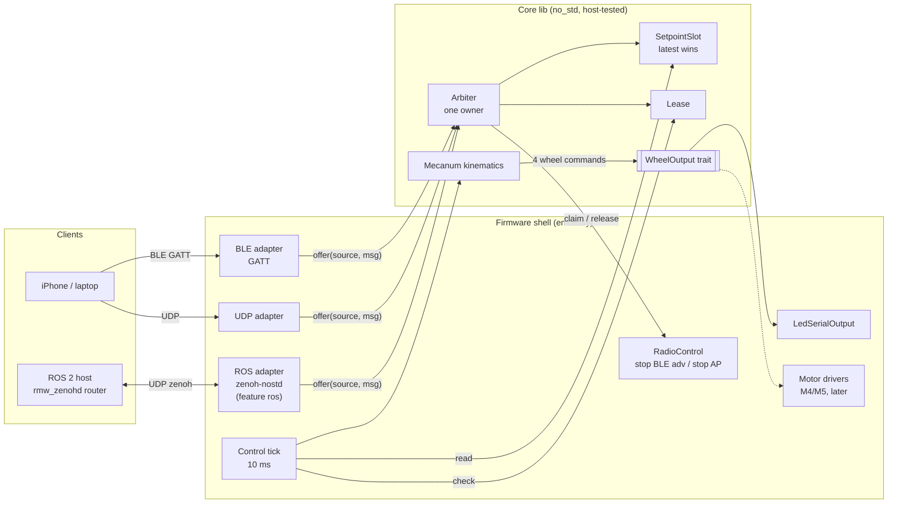
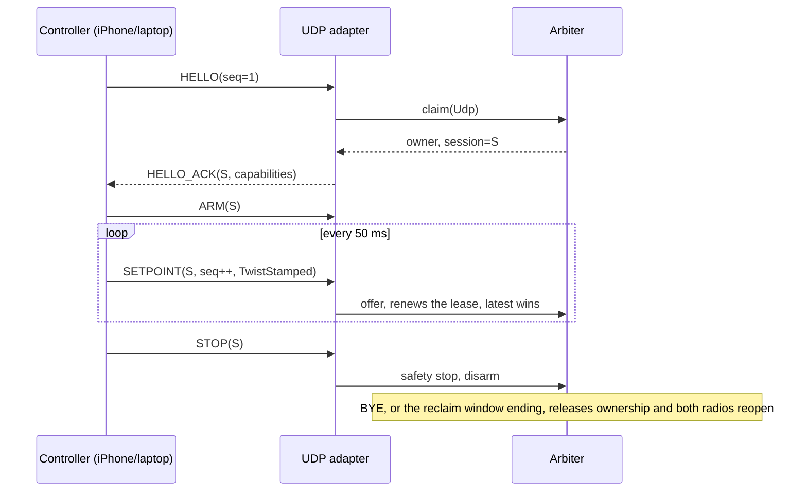
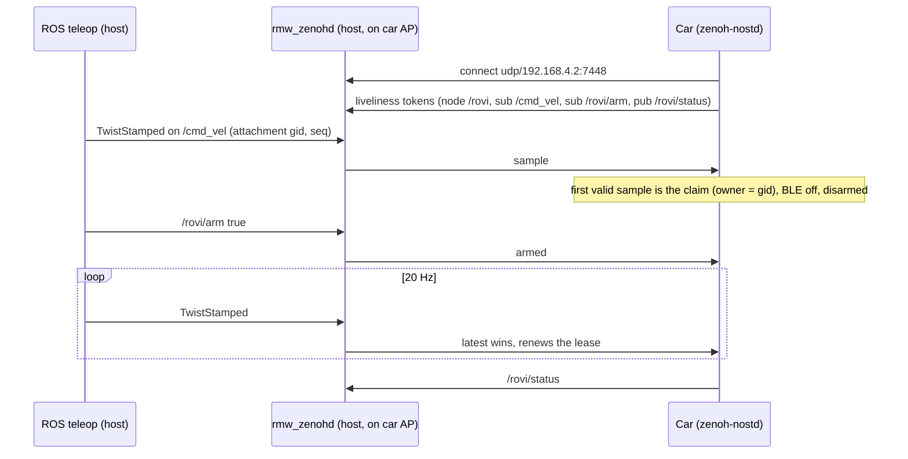
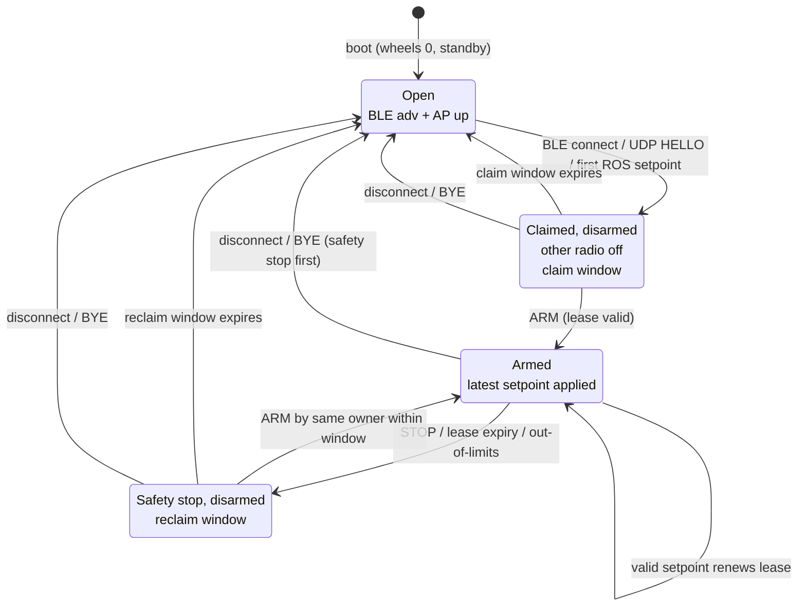
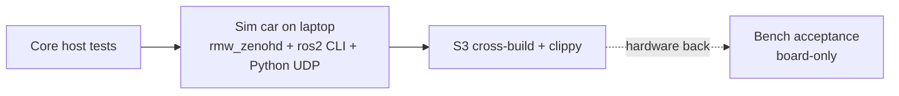

# Rovi M8: setpoint protocol, single owner, optional ROS 2

**Status: design approved 2026-10-06; not implemented.** Board-only ESP32-S3 firmware (no motors). It supersedes M3's TCP+FIFO design ([ADR-0004](../../docs/adr/0004-single-owner-latest-setpoint.md)). The ROS 2 backend is described in [ADR-0005](../../docs/adr/0005-zenoh-nostd-ros-backend.md). Terms are as defined in [`GLOSSARY.md`](../../GLOSSARY.md). Open items are in [PLAN](../../docs/PLAN.md#open-questions-and-decisions).

## Architecture

The package has a host-tested `no_std` core plus a thin embassy firmware shell. Adapters only decode input and offer it to the arbiter. Only the control tick drives outputs.



The core library contains:

* `Setpoint`, with limits.
* The CDR codec and the UDP framing.
* `Arbiter`, `Lease` and `SetpointSlot`.
* `mecanum::inverse`.
* The `WheelOutput` trait.
* The `rmw_zenoh` wire contract: key builder, attachment, liveliness keys.

Carried over from M3: the car AP (WPA2, `192.168.4.1/24`), the compile-time settings, and the serial-log and bench conventions. Not carried over: the FIFO, TCP protocol v1, and M2's one-byte commands.

## Setpoint

A setpoint is a **`geometry_msgs/TwistStamped`**, the input of ros2_controllers' [`mecanum_drive_controller`](https://control.ros.org/jazzy/doc/ros2_controllers/mecanum_drive_controller/doc/userdoc.html):

* **Fields used:** `linear.x` and `linear.y` in m/s, `angular.z` in rad/s, in `base_link` (REP-103: x forward, y left, counter-clockwise positive).
* **Other Twist components:** must be zero, or the setpoint is rejected.
* **Encoding:** on every transport, the setpoint is carried as its **CDR encoding**: the 4-byte encapsulation header, then the header (stamp, `frame_id`), then 6 × f64. With an empty `frame_id` that is 68 bytes.

### Kinematics

The car uses the same inverse kinematics as `mecanum_drive_controller` (Jazzy source), with r = `wheels_radius`, L = `sum_of_robot_center_projection_on_X_Y_axis` and an optional `base_frame_offset`:

```text
FL = (vx − vy − L·wz) / r      FR = (vx + vy + L·wz) / r
RR = (vx − vy + L·wz) / r      RL = (vx + vy − L·wz) / r
```

* **Output:** wheel speeds in rad/s, normalised to wheel commands by `max_wheel_speed`. That is a placeholder until M5 calibrates it.
* **Wheel order:** FL, FR, RR, RL.

### Timing

* **Staleness:** decided by **receive time and sequence**. A sequence that isn't newer is dropped, and nothing older than the latest setpoint is ever applied.
* **Header stamp:** carried, but not trusted for age unless clocks are synchronised (Q17).

## Transports

### UDP

UDP runs on the car AP, port `7777`. Each datagram is a `RoviHeader` followed by an optional CDR payload:

```text
RoviHeader { magic "RV", version u8, kind u8, session u32, seq u32 }
kind: HELLO | HELLO_ACK | SETPOINT | ARM | STOP | BYE | STATUS | BUSY
```

* `HELLO_ACK` carries the capabilities: protocol version, session id, `wheels_radius`, L, maximum vx/vy/wz, lease and window lengths.
* A setpoint stream at 20 Hz is recommended.



### BLE

The BLE connection is the session, and connecting is the claim. The service has a new UUID; it is not M2-compatible.

| Characteristic | Access | Payload |
| --- | --- | --- |
| Setpoint | write without response | `seq u32` + CDR `TwistStamped` (72 B; needs ATT MTU ≥ 75, Q18) |
| Control | write with response | ARM / STOP |
| Capabilities | read | as in `HELLO_ACK` |
| Status | notify | owner, armed, lease state, last seq, stop reason |

### ROS 2 (feature `ros`)

The car is a zenoh-nostd client of `rmw_zenohd` at `ROVI_ZENOH_ROUTER` (default `udp/192.168.4.2:7448`). It reconnects with backoff.

| Topic | Type | Direction |
| --- | --- | --- |
| `/cmd_vel` (configurable) | `geometry_msgs/TwistStamped` | subscribe, best-effort, depth 1 |
| `/rovi/arm` | `std_msgs/Bool` | subscribe; `true` arms, `false` stops and disarms |
| `/rovi/status` | `std_msgs/String` | publish |

* **Wire contract** ([S2](../../docs/research/s2-zenoh-nostd-spike.md)):
  * Key expression: `<domain>/<topic>/<type>/<RIHS01 hash>`.
  * Payload: CDR.
  * Attachment: 33 bytes (`seq` i64, timestamp i64, LEB128 `16`, 16-byte gid).
* **Type hashes:** copied from a ROS 2 Jazzy install and checked against a live router.
* **Ownership:** the owner is identified by its publisher gid, and other gids are ignored.
* **Graph visibility:** the node `/rovi` and its topics are announced with `rmw_zenoh` liveliness tokens. This is M8's first risk item (Q2).



## Ownership, arming and safety

* **Claim.** On a BLE connect, UDP `HELLO` or first valid ROS setpoint, the controller becomes the owner and the other radio shuts down. Other claimants get `BUSY` (UDP) or are ignored (ROS).
* **Arming.** A new owner starts disarmed. Setpoints renew the lease but only move the device after an explicit ARM. Every safety stop disarms.
* **Lease.** Only the owner's valid setpoints renew the lease. Default 1 s.
* **Claim window.** The owner must send its first setpoint or ARM within 10 s of the claim. This covers slow BLE service discovery.
* **Safety stop.** Triggered by STOP, lease expiry, owner loss or an out-of-limits setpoint. Wheels go to zero, drivers go to standby, and the device disarms. The control tick checks for it every 10 ms, independently of incoming traffic.
* **Release.**
  * STOP keeps the owner.
  * After lease expiry, the owner has a **reclaim window** (default 5 s) to resume by arming again without reconnecting.
  * When the window ends, or on disconnect or `BYE`, ownership is released and both radios reopen.

All three durations are compile-time settings.



## Testing



1. **Core host tests** (test-first):
   * CDR golden vectors captured from real ROS 2 bytes.
   * Kinematics vectors from the `mecanum_drive_controller` formulas.
   * `rmw_zenoh` keys, attachments and liveliness keys.
   * The ownership and lease state machine.
2. **Sim car on the laptop.** The same core and adapters run on std UDP and zenoh-nostd's std platform, and are driven by `rmw_zenohd`, the ROS 2 CLI or `teleop_twist_keyboard` (stamped), and a Python UDP client. This is development evidence only ([ADR-0002](../../docs/adr/0002-simulation-never-proves-hardware.md)).
3. **S3 cross-build and clippy** at every step. Then, once hardware is available, bench acceptance as listed in [MILESTONE.md](MILESTONE.md).

## Not in M8

* Motors, encoders, closed-loop control, and the `ros2_control` hardware (wheel-velocity) mode.
* Station mode and runtime configuration.
* BLE security.
* Video, Nav2 and odometry.
* An iPhone app: M8 is accepted with laptop clients (Q9).
